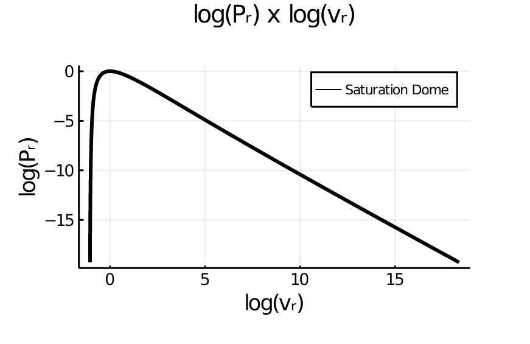
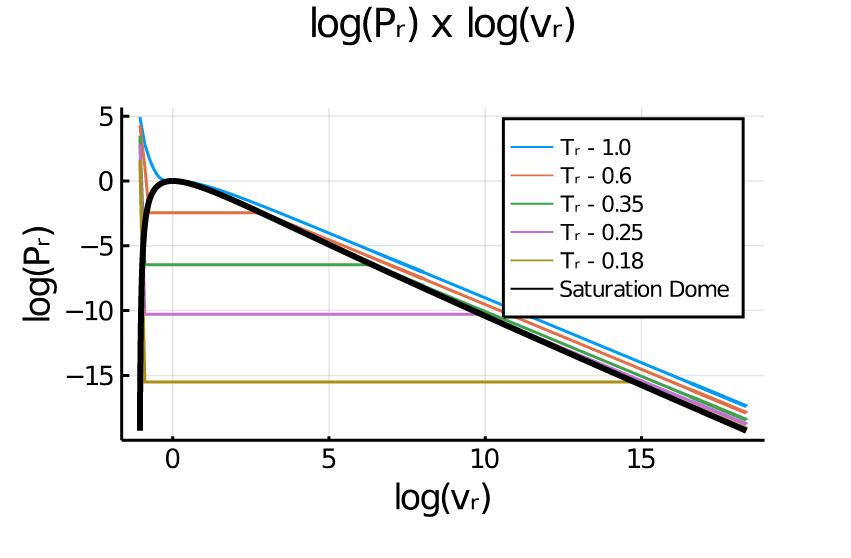
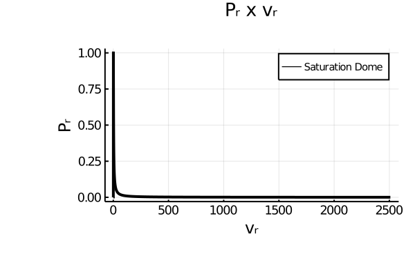
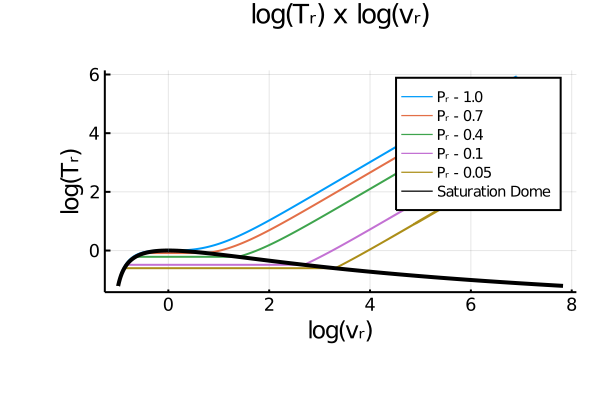
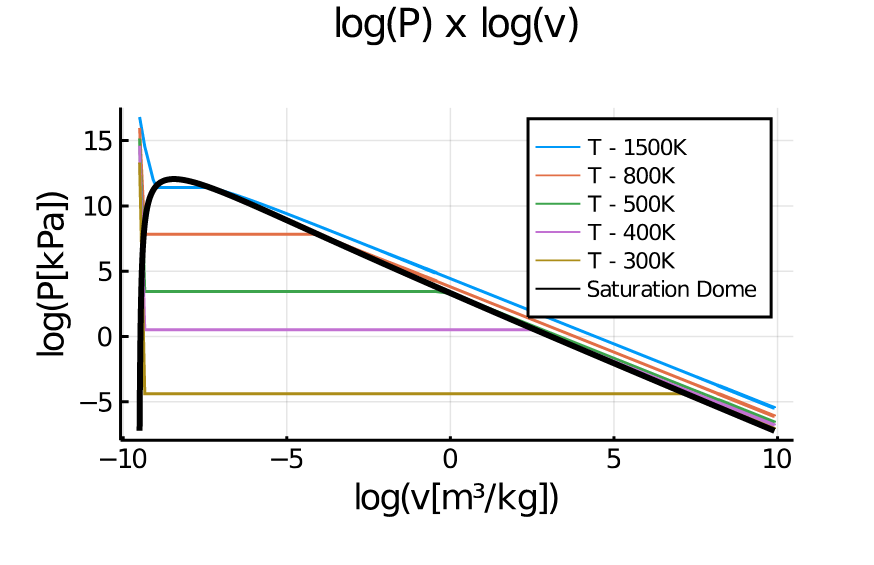
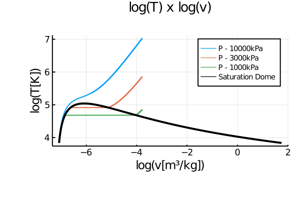

# vdWProp

This package uses the van der Waals Equation of State to implement a function with the capacity to define a State using two properties and a substance as arguments, using a hypothesis of constant Specific Heat at constant volume.

## Base

All the functions from this package are based in the EngThermBase.jl package, so all the properties required as arguments need to be in the [EngThermBase](https://github.com/JEngTherm/EngThermBase.jl) format, and all the notations used (including the notation used in this documentation) are the same as well. Also, the [EngTherm](https://github.com/JEngTherm/EngTherm.jl) page is very informative about the formats and notations. As an example, to use a pressure of 200 kPa as an argument, it will be in the format `P(200)`. 

## Constant Specific Heat at constant volume Hypothesis

The hypothesis uses cv = φR, where φ depends on the substance type. For monoatomic substances φ = 3/2, for diatomic substances φ = 5/2, and for other substances φ = 7/2.

## Substances

There are 398 available substances to use in the functions and they can be checked in substances.jl. The more a substance can be approximate to a van der Waal gas, the better the results, so the functions work better depending on the used substance. All the substance names are in formula format, so any of them can be called using `vdWProp.substanceformula`, like the example below.

```julia
julia> using vdWProp

julia> vdWProp.H2O
vdWProp.vdWGas("Water", T₆₄: 647.14 K, P₆₄: 22060 kPa, v₆₄: 0.0031085 m³/kg, M₆₄: 18.015 kg/kmol, 3.5)
```

The substance has its type structure, vdWGas, and as can be seen in the example, it stores the substance name as a String, the critical temperature, critical pressure, critical volume and molar mass (all these properties in the [EngThermBase](https://github.com/JEngTherm/EngThermBase.jl) format), and the Specific Heat Constant as a Float. Any of the stored information can be called using the exemplified functions below, and the gas constant of the substance and the two van der Waals constants can be calculated.

```julia
julia> using vdWProp

julia> H2O = vdWProp.H2O
vdWProp.vdWGas("Water", T₆₄: 647.14 K, P₆₄: 22060 kPa, v₆₄: 0.0031085 m³/kg, M₆₄: 18.015 kg/kmol, 3.5)

julia> name(H2O)
"Water"

julia> Pc(H2O)
P₆₄: 22060 kPa

julia> Tc(H2O)
T₆₄: 647.14 K

julia> vc(H2O)
v₆₄: 0.0031085 m³/kg

julia> M(H2O)
M₆₄: 18.015 kg/kmol

julia> ϕ(H2O)
3.5

julia> R_gas(H2O)
Δs₆₄: 0.28257 kJ/K/kg

julia> α(H2O)
?₆₄: 0.63947 kJ^2 kg^-2 kPa^-1

julia> b(H2O)
v₆₄: 0.0010362 m³/kg
```

There are different substances with the same formula, in these cases, the substance name has an _n in the end, like in the example below.

```julia
julia> using vdWProp

julia> vdWProp.C5H12
vdWProp.vdWGas("Pentane", T₆₄: 469.7 K, P₆₄: 3370 kPa, v₆₄: 0.0043105 m³/kg, M₆₄: 72.15 kg/kmol, 3.5)

julia> vdWProp.C5H12_2
vdWProp.vdWGas("Isopentane", T₆₄: 460.4 K, P₆₄: 3380 kPa, v₆₄: 0.0042412 m³/kg, M₆₄: 72.15 kg/kmol, 3.5)

julia> vdWProp.C5H12_3
vdWProp.vdWGas("Neopentane", T₆₄: 433.8 K, P₆₄: 3196 kPa, v₆₄: 0.004255 m³/kg, M₆₄: 72.15 kg/kmol, 3.5)

```

## State Function

The substance state is calculated using the State function, this function receives as arguments, in this order,  a substance and two properties, and to calculate the state in the molar base, it needs a boolean argument, `true`, in the end. Also, because the arguments are in the [EngThermBase](https://github.com/JEngTherm/EngThermBase.jl) format, a line `using EngThermBase` is needed.

The supported pairs of properties are any pair containing two of the properties: P, T, v, u, h, s, Q. The quality (Q) don't have a specific format in the [EngThermBase](https://github.com/JEngTherm/EngThermBase.jl) package, to use it as an argument it needs to be in the format `AMT(Q)` where Q is the numerical value of the quality. The intensive properties used as arguments always needs to be in the mass base format.

This function gives as result a 16x1 array whose terms are, in this order, Pressure, Temperature, Volume, Internal Energy, Enthalpy, Entropy, Helmholtz Specific Energy, Specific Heat at constant volume, Specific Heat at constant pressure, Specific Heat Ratio, Isothermal Compressibility, Isentropic Compressibility, Coefficient of Volume Expansion, Isentropic Expansion Exponent, Speed of Sound and Quality (or the String "out" when outside of the saturation dome), like it can be seen in the example below.

```julia
julia> using EngThermBase

julia> using vdWProp

# Example 1 - Outside of the saturation dome

julia> State(vdWProp.Hg, T(1500), P(1000))
16-element Array{Any,1}:
 P₆₄: 1000 kPa
 T₆₄: 1500 K
 v₆₄: 0.084067 m³/kg
 u₆₄: 126.13 kJ/kg
 h₆₄: 210.2 kJ/kg
 s₆₄: 0.3842 kJ/K/kg
 a₆₄: -450.17 kJ/kg
 cv₆₄: 0.084277 kJ/K/kg
 cp₆₄: 0.14084 kJ/K/kg
 ?₆₄: 1.6712 
 ?₆₄: 0.00067058 K^-1
 ?₆₄: 0.0010025 kPa^-1
 ?₆₄: 0.00059989 kPa^-1
 ?₆₄: 1.667 
 𝕍₆₄: 61.65 √kJ/kg
 "out"
 
# Example 2 - Inside of the saturation dome
 
julia> State(vdWProp.Hg, T(1000), v(0.00022))
16-element Array{Any,1}:
 P₆₄: 11210 kPa
 T₆₄: 1000 K
 v₆₄: 0.00022 m³/kg
 u₆₄: -169.03 kJ/kg
 h₆₄: -166.56 kJ/kg
 s₆₄: -0.11129 kJ/K/kg
 a₆₄: -57.735 kJ/kg
 cv₆₄: 0.084277 kJ/K/kg
 cp₆₄: 0.18164 kJ/K/kg
 ?₆₄: 2.1552 
 ?₆₄: -0.0015916 K^-1
 ?₆₄: -2.3829e-06 kPa^-1
 ?₆₄: -2.1647e-05 kPa^-1
 ?₆₄: 0.41364 
 "Speed of Sound out of Domain"
 ?₆₄: 0.028394 
 
# Example 3 - Molar Base
 
julia> State(vdWProp.Hg, T(1000), v(0.00022), true)
16-element Array{Any,1}:
 P₆₄: 11210 kPa
 T₆₄: 1000 K
 v̄₆₄: 0.04413 m³/kmol
 ū₆₄: -33906 kJ/kmol
 h̄₆₄: -33411 kJ/kmol
 s̄₆₄: -22.324 kJ/K/kmol
 ā₆₄: -11581 kJ/kmol
 c̄v₆₄: 16.905 kJ/K/kmol
 c̄p₆₄: 36.434 kJ/K/kmol
 ?₆₄: 2.1552 
 ?₆₄: -0.0015916 K^-1
 ?₆₄: -2.3829e-06 kPa^-1
 ?₆₄: -2.1647e-05 kPa^-1
 ?₆₄: 0.41364 
 "Speed of Sound out of Domain"
 ?₆₄: 0.028394 
 
```

## IsoProp Function

This function calculates two states of a process of the "iso-type", meaning one of the properties in the first state is going to stay the same in the second state. The arguments for this function are, in this order, a substance, two properties of the first state, one property of the second state, a string with the property that is going to stay constant ("P", "T", "v", "u", "h", or "s"), and if the states are wanted in the molar form, a boolean argument `true`. The intensive properties used as arguments always needs to be in the mass base format.

This function results in a 16x2 array, with each state in one of the columns, giving the same properties in the same order as the State function. It can be seen in the example below.

```julia
julia> using EngThermBase

julia> using vdWProp

# Example 1 - Outside of the saturation dome

julia> IsoProp(vdWProp.Hg, T(1500), P(1000), T(1600), "v")
16×2 Array{Any,2}:
 P₆₄: 1000 kPa           P₆₄: 1066.9 kPa
 T₆₄: 1500 K             T₆₄: 1600 K
 v₆₄: 0.084067 m³/kg     v₆₄: 0.084067 m³/kg
 u₆₄: 126.13 kJ/kg       u₆₄: 134.56 kJ/kg
 h₆₄: 210.2 kJ/kg        h₆₄: 224.25 kJ/kg
 s₆₄: 0.3842 kJ/K/kg     s₆₄: 0.38964 kJ/K/kg
 a₆₄: -450.17 kJ/kg      a₆₄: -488.87 kJ/kg
 cv₆₄: 0.084277 kJ/K/kg  cv₆₄: 0.084277 kJ/K/kg
 cp₆₄: 0.14084 kJ/K/kg   cp₆₄: 0.14082 kJ/K/kg
 ?₆₄: 1.6712             ?₆₄: 1.6709 
 ?₆₄: 0.00067058 K^-1    ?₆₄: 0.00062841 K^-1
 ?₆₄: 0.0010025 kPa^-1   ?₆₄: 0.00093946 kPa^-1
 ?₆₄: 0.00059989 kPa^-1  ?₆₄: 0.00056226 kPa^-1
 ?₆₄: 1.667              ?₆₄: 1.667 
 𝕍₆₄: 61.65 √kJ/kg       𝕍₆₄: 63.68 √kJ/kg
 "out"                   "out"

# Example 2 - Inside of the saturation dome

julia> IsoProp(vdWProp.Hg, T(1000),v(0.00022), T(900),"s")
16×2 Array{Any,2}:
 P₆₄: 11210 kPa                  P₆₄: 5767.6 kPa
 T₆₄: 1000 K                     T₆₄: 900 K
 v₆₄: 0.00022 m³/kg              v₆₄: 0.00073307 m³/kg
 u₆₄: -169.03 kJ/kg              u₆₄: -173.07 kJ/kg
 h₆₄: -166.56 kJ/kg              h₆₄: -168.84 kJ/kg
 s₆₄: -0.11129 kJ/K/kg           s₆₄: -0.11129 kJ/K/kg
 a₆₄: -57.735 kJ/kg              a₆₄: -72.916 kJ/kg
 cv₆₄: 0.084277 kJ/K/kg          cv₆₄: 0.084277 kJ/K/kg
 cp₆₄: 0.18164 kJ/K/kg           cp₆₄: 0.17188 kJ/K/kg
 ?₆₄: 2.1552                     ?₆₄: 2.0395 
 ?₆₄: -0.0015916 K^-1            ?₆₄: -0.0025758 K^-1
 ?₆₄: -2.3829e-06 kPa^-1         ?₆₄: -0.00028047 kPa^-1
 ?₆₄: -2.1647e-05 kPa^-1         ?₆₄: 1.8907e-05 kPa^-1
 ?₆₄: 0.41364                    ?₆₄: 1.6372 
 "Speed of Sound out of Domain"  𝕍₆₄: 32.428 √kJ/kg
 ?₆₄: 0.028394                   ?₆₄: 0.078088 
 
# Example 3 - Molar Base

julia> IsoProp(vdWProp.Hg, T(1500), P(1000), T(1600), "v", true)
16×2 Array{Any,2}:
 P₆₄: 1000 kPa            P₆₄: 1066.9 kPa
 T₆₄: 1500 K              T₆₄: 1600 K
 v̄₆₄: 16.863 m³/kmol     v̄₆₄: 16.863 m³/kmol
 ū₆₄: 25301 kJ/kmol       ū₆₄: 26992 kJ/kmol
 h̄₆₄: 42164 kJ/kmol      h̄₆₄: 44983 kJ/kmol
 s̄₆₄: 77.067 kJ/K/kmol   s̄₆₄: 78.158 kJ/K/kmol
 ā₆₄: -90300 kJ/kmol      ā₆₄: -98062 kJ/kmol
 c̄v₆₄: 16.905 kJ/K/kmol  c̄v₆₄: 16.905 kJ/K/kmol
 c̄p₆₄: 28.251 kJ/K/kmol  c̄p₆₄: 28.246 kJ/K/kmol
 ?₆₄: 1.6712              ?₆₄: 1.6709 
 ?₆₄: 0.00067058 K^-1     ?₆₄: 0.00062841 K^-1
 ?₆₄: 0.0010025 kPa^-1    ?₆₄: 0.00093946 kPa^-1
 ?₆₄: 0.00059989 kPa^-1   ?₆₄: 0.00056226 kPa^-1
 ?₆₄: 1.667               ?₆₄: 1.667 
 𝕍₆₄: 61.65 √kJ/kg        𝕍₆₄: 63.68 √kJ/kg
 "out"                    "out"
  
```

## Plots

This package has a Plotting Function that uses [Plots.jl](https://github.com/JuliaPlots/Plots.jl) as dependence. The function consists of plotting the saturation dome for van der Waals substances in a P-v or T-v diagram (reduced or dimensional form) with the possibility to insert isotherm or isobaric lines depending on the diagram type. There are five arguments to use it, the substance (not necessary for reduced diagrams), an array with the temperatures of the isotherms (or pressures for isobaric lines), a boolean argument with `false` resulting in the P-v diagram and `true` resulting in the T-v diagram (`false` is the default), the final value of the volume for the iso-lines, and a string argument with `"log"` as the default that returns the logarithmic diagram and `"original"` for the not logarithmic diagram (not recommendable because of the low visibility). 

```julia
julia> PlotDome()

```

```julia
julia> PlotDome([1, 0.8, 0.6, 0.4])

```

```julia
julia> PlotDome([], false, 1000, "original")

```

```julia
julia> PlotDome([1, 0.7, 0.4, 0.1, 0.05], true)

```

```julia
julia> PlotDome(vdWProp.Hg, [1500, 1200, 1000, 800, 700, 600])

```

```julia
julia> PlotDome(vdWProp.O2, [10000, 3000, 1000], true, 10)

```
